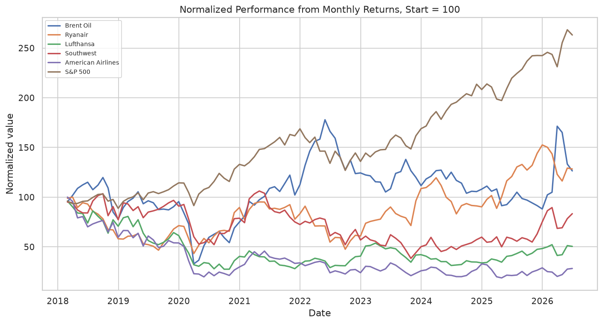
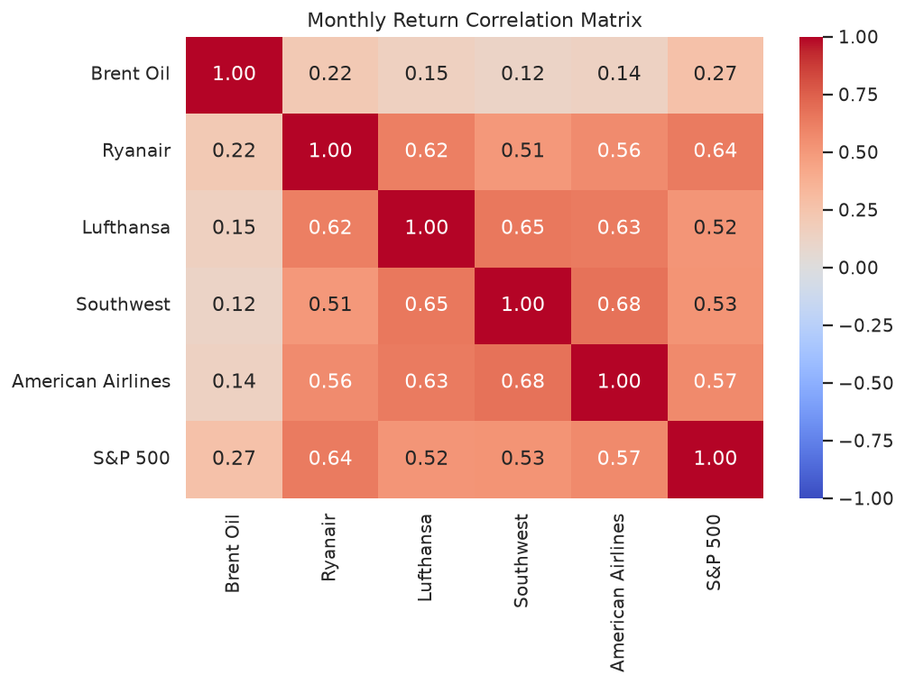
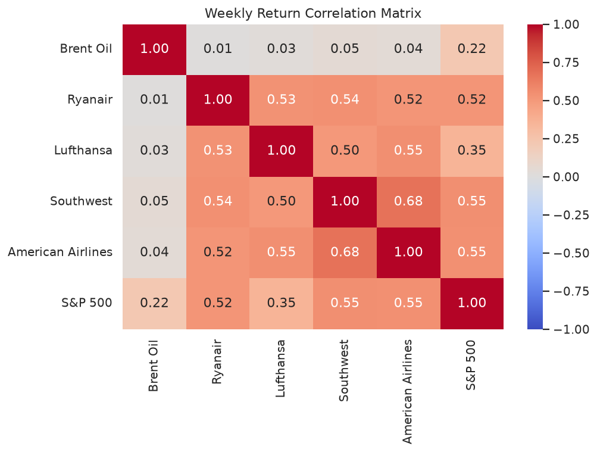
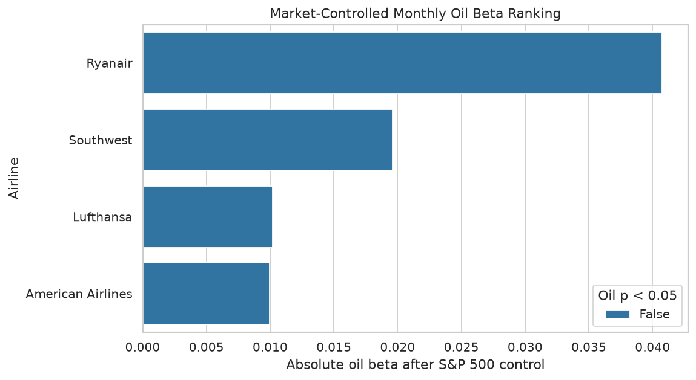
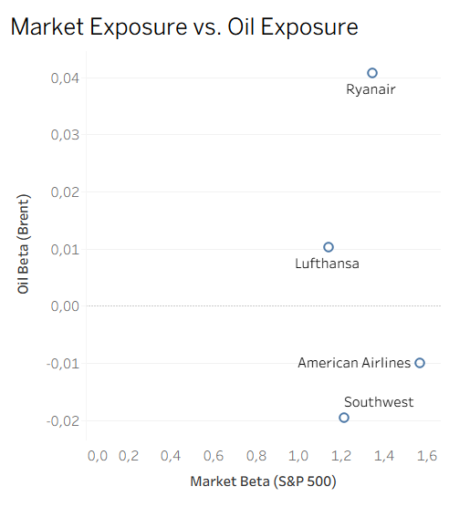
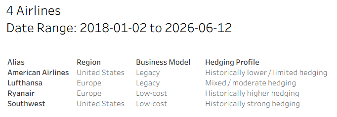
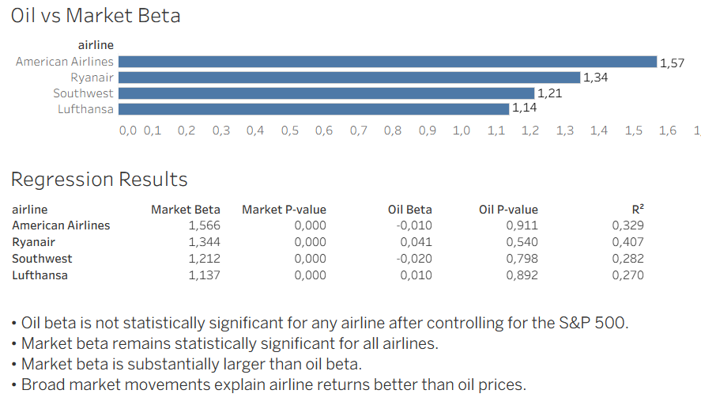

# Fuel, Hedging, and Business Models: Airline Stock Sensitivity to Oil

This project explores whether airline stocks are driven more by Brent crude oil prices or by the broader stock market.

## Project Overview

The analysis compares Brent crude oil, the S&P 500, and four major airlines using weekly and monthly returns, regression models, and interactive Tableau dashboards.

## Skills Demonstrated

- Financial data collection
- Data cleaning and transformation
- Time-series analysis
- Linear regression
- Data visualization
- Tableau dashboard development

## Dataset

Source: Yahoo Finance (`yfinance`)

Period: 2018–present

Assets:

- Brent Crude Oil
- S&P 500
- Ryanair
- Lufthansa
- Southwest Airlines
- American Airlines

## Methodology

1. Download historical market data.
2. Calculate weekly and monthly returns.
3. Build regression models.
4. Compare the results in Python and Tableau.

## Figures

Interactive Tableau dashboards: [(https://public.tableau.com/app/profile/marcus.timm/vizzes)]

### Normalized Performance



Brent experienced large price swings, but airline performance differed across companies.

---

### Monthly Correlation



Airline stocks are more closely correlated with each other and with the S&P 500 than with Brent oil.

---

### Weekly Correlation



Weekly relationships between Brent and airline returns are even weaker, suggesting short-term movements are dominated by market noise.

---

### Oil Beta



After controlling for market movements, none of the airlines has a statistically significant monthly oil beta.

---

### Market vs. Oil Beta



All four airlines have much larger market betas than oil betas, reinforcing that the broader market has a greater influence than oil prices.

---

## Dashboard



---



## Key Findings

- Market exposure dominates oil exposure after controlling for the S&P 500.
- Monthly oil beta is not statistically significant for any airline in the market-controlled model.
- Market beta is statistically significant for all airlines and substantially larger than oil beta.
- Weekly oil sensitivity remains significant only for Ryanair and American Airlines.
- The common assumption that airline stocks are primarily driven by oil prices is not supported by the data.

## Limitations

- This is exploratory analysis, not causal proof.
- Regression relationships are historical associations only.
- Several oil-only models have low R² values, meaning Brent returns explain only a small share of airline return variation.
- Hedging classifications are simplified and may not reflect each airline’s exact hedge book through time.
- The sample is limited to four airlines.
- Weekly results are noisier than monthly results.

## Getting Started

```bash
pip install -r requirements.txt
jupyter notebook
```
Run the notebooks in numerical order (`01` → `04`).

---

## Future Improvements

- Expand the analysis to include more airlines and regions.
- Compare airline performance during major oil shock events.
- Analyze the impact of different types of oil shocks, such as geopolitical events and OPEC production changes.

---
