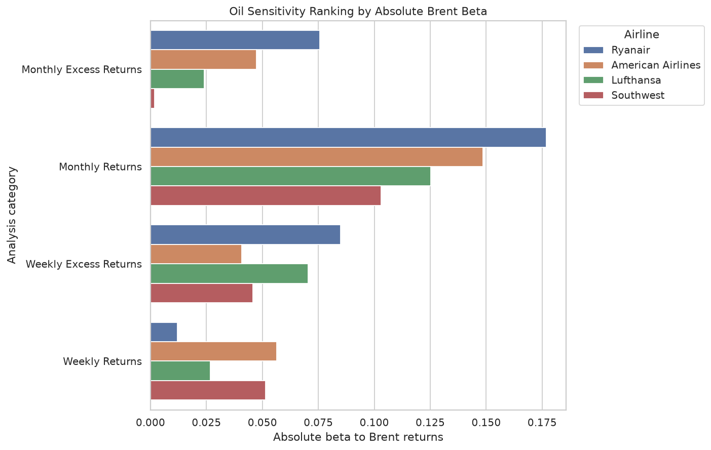

# Fuel, Hedging, and Business Models: Airline Stock Sensitivity to Oil

A Python and Tableau portfolio project testing whether airline stocks are as sensitive to Brent crude oil returns as investors often assume.

## Research Question

How sensitive are different airline business models to changes in oil prices?

## Why This Project Matters

Fuel is one of the most visible costs in the airline industry, so it is tempting to assume that rising oil prices automatically hurt airline stocks. This project tests that assumption using market data, weekly and monthly returns, excess returns versus the S&P 500, oil-shock periods, and market-controlled regression models.

The result is more nuanced: oil matters in some cases, but broad equity-market exposure explains much more of the observed airline stock movement.

## Tools Used

- Python
- pandas
- NumPy
- yfinance
- scipy
- statsmodels
- matplotlib
- seaborn
- Jupyter Notebook
- Tableau planning assets
- Git / GitHub

## Dataset and Assets

Data source: Yahoo Finance via `yfinance`.

Time period: from `2018-01-01` through the latest available data at collection time.

Assets analyzed:

| Type | Asset | Ticker | Notes |
|---|---|---:|---|
| Oil benchmark | Brent Crude Oil Futures | `BZ=F` | Main oil-price proxy |
| Market benchmark | S&P 500 | `^GSPC` | Used for excess returns and market control |
| Airline | Ryanair | `RYAAY` | Europe, low-cost, historically higher hedging |
| Airline | Lufthansa | `LHA.DE` | Europe, legacy, mixed/moderate hedging |
| Airline | Southwest Airlines | `LUV` | United States, low-cost, historically strong hedging |
| Airline | American Airlines | `AAL` | United States, legacy, historically lower hedging |

Primary Tableau-ready file:

- `data/tableau/airline_oil_tableau_dataset.csv`

Validated summary files:

- `data/processed/oil_sensitivity_summary.csv`
- `data/processed/oil_market_sensitivity_summary.csv`
- `data/processed/oil_shock_summary.csv`
- `data/processed/tableau_validation_report.md`

## Methodology

1. Download adjusted price data from Yahoo Finance.
2. Resample prices into weekly and monthly series.
3. Calculate airline, Brent, and S&P 500 returns.
4. Calculate airline excess returns:

   `Excess Return = Airline Return - S&P 500 Return`

5. Estimate simple oil sensitivity:

   `Airline Return = alpha + beta * Brent Return`

6. Estimate market-controlled sensitivity:

   `Airline Return = alpha + oil_beta * Brent Return + market_beta * S&P 500 Return`

7. Analyze oil-shock periods, defined as the top 20% of positive Brent-return periods.
8. Validate Tableau export files for completeness, schema quality, missing values, frequency coverage, airline coverage, and numeric fields.

## Key Findings

- Market exposure dominates oil exposure after controlling for the S&P 500.
- Monthly oil beta is not statistically significant for any airline after market control.
- Market beta is statistically significant for all four airlines across both weekly and monthly frequencies.
- Weekly oil beta remains statistically significant only for Ryanair and American Airlines, and both relationships are negative.
- Simple oil sensitivity is weak and inconsistent. The strongest simple relationships still have low R² values.
- The original “oil hurts airlines” assumption is too simplistic. Airline stocks appear to reflect broader market forces more than Brent oil returns alone.
- Ryanair’s positive monthly simple oil beta disappears after market control, suggesting the simple result was likely market-driven rather than oil-specific.
- Oil-shock findings depend on frequency: monthly oil-shock excess returns were positive for Southwest, Lufthansa, and Ryanair, while weekly oil-shock excess returns were negative for all four airlines.

## Selected Visual Outputs

The project includes Python-generated visuals in `images/`:





## Tableau Dashboard Plan

The Tableau story is designed around actual findings rather than the original hypotheses.

Planned dashboards:

1. Project Overview
2. Simple Oil Sensitivity
3. Market-Controlled Sensitivity
4. Oil Shock Analysis
5. Final Findings

Full specification:

- `tableau/dashboard_plan.md`

## Repository Structure

```text
.
├── data/
│   ├── raw/
│   │   └── raw_prices.csv
│   ├── processed/
│   │   ├── weekly_returns.csv
│   │   ├── monthly_returns.csv
│   │   ├── weekly_excess_returns.csv
│   │   ├── monthly_excess_returns.csv
│   │   ├── oil_sensitivity_summary.csv
│   │   ├── oil_market_sensitivity_summary.csv
│   │   ├── oil_shock_summary.csv
│   │   └── tableau_validation_report.md
│   └── tableau/
│       └── airline_oil_tableau_dataset.csv
├── images/
├── notebooks/
│   ├── 01_data_collection.ipynb
│   ├── 02_data_cleaning_and_returns.ipynb
│   ├── 03_analysis.ipynb
│   └── 04_tableau_export_validation.ipynb
├── src/
│   └── config.py
├── tableau/
│   └── dashboard_plan.md
├── data_dictionary.md
├── key_findings.md
├── project_plan.md
├── research_log.md
├── requirements.txt
└── README.md
```

## How to Run the Project

From the project root:

```bash
python -m venv .venv
source .venv/bin/activate
pip install -r requirements.txt
```

Run the notebooks in order:

```bash
jupyter notebook notebooks/01_data_collection.ipynb
jupyter notebook notebooks/02_data_cleaning_and_returns.ipynb
jupyter notebook notebooks/03_analysis.ipynb
jupyter notebook notebooks/04_tableau_export_validation.ipynb
```

Or execute them with `nbconvert` from the repository root:

```bash
jupyter nbconvert --to notebook --execute --inplace notebooks/01_data_collection.ipynb
jupyter nbconvert --to notebook --execute --inplace notebooks/02_data_cleaning_and_returns.ipynb
jupyter nbconvert --to notebook --execute --inplace notebooks/03_analysis.ipynb
jupyter nbconvert --to notebook --execute --inplace notebooks/04_tableau_export_validation.ipynb
```

The final Tableau-ready dataset is:

```text
data/tableau/airline_oil_tableau_dataset.csv
```

## Limitations

- This is exploratory analysis, not causal proof.
- Regression relationships are historical associations only.
- Several oil-only models have low R² values, meaning Brent returns explain only a small share of airline return variation.
- Hedging classifications are simplified and may not reflect each airline’s exact hedge book through time.
- The sample is limited to four airlines.
- Weekly results are noisier than monthly results.
- Public market data can contain calendar effects, holidays, and ticker-specific availability issues.

## Disclaimer

This project is for educational and portfolio purposes only. It is exploratory analysis, not investment advice, and should not be used as the sole basis for any investment decision.
